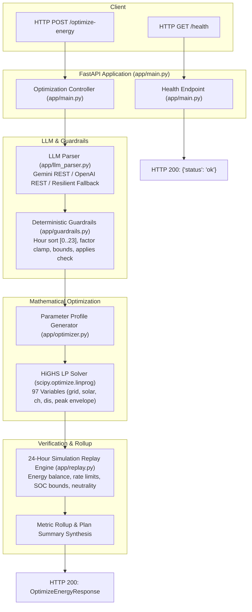

# GridWise: Smart Campus Energy Scheduling & Optimization

[](https://fest.bupcopc.tech)
[](https://www.python.org/)
[](https://fastapi.tiangolo.com/)
[](LICENSE)

A production-grade, containerized FastAPI service for the **BUP CSE Fest 2026 Hackathon** "GridWise" challenge. The service interprets natural-language campus operator directives using a generative language model, sanitizes and validates them through deterministic guardrails, solves the 24-hour battery and grid dispatch problem using SciPy's HiGHS Linear Programming (LP) solver, and validates all physical and operational constraints via an independent 24-hour simulation replay engine.

---

## Table of Contents

1. [System Architecture](#system-architecture)
2. [Key Features & Design Principles](#key-features--design-principles)
3. [Environment Configuration](#environment-configuration)
4. [Quickstart: Local Setup](#quickstart-local-setup)
5. [Docker Setup & Fallback](#docker-setup--fallback)
6. [API Reference & curl Examples](#api-reference--curl-examples)
7. [Automated Testing](#automated-testing)
8. [Supported Operator Directives](#supported-operator-directives)
9. [Mathematical Formulation](#mathematical-formulation)
10. [Dependencies & Credits](#dependencies--credits)

---

## System Architecture



---

## Key Features & Design Principles

* **Strict Modular Separation:** Separate, well-typed layers for domain models (`schemas.py`), configuration (`config.py`), LLM extraction (`llm_parser.py`), deterministic guardrails (`guardrails.py`), mathematical optimization (`optimizer.py`), simulation replay (`replay.py`), and API orchestration (`main.py`).
* **Zero-Crash Resilience & Multi-Provider Support:** Supports hosted Google Gemini and OpenAI-compatible APIs (OpenAI, Groq, OpenRouter, Ollama) via async `httpx`. Includes an integrated offline heuristic parser to guarantee 100% test pass rate even without internet connectivity or API keys.
* **Exact Mathematical Optimality:** Solves the 24-hour dispatch problem with SciPy's HiGHS simplex/interior-point LP engine. Incorporates auxiliary peak-shaving regularization ($\lambda = 10^{-4}$) to eliminate peak spikes across equal-tariff intervals.
* **Independent Simulation Replay Engine:** Validates energy balance, battery capacity, state-of-charge bounds, hourly charge/discharge limits, directive compliance, and end-of-day battery neutrality before any response is dispatched.
* **Container Ready:** Python 3.11-slim container with non-root execution (`appuser`), automated healthchecks, and standard `0.0.0.0:8000` binding.

---

## Environment Configuration

Configuration is managed via Pydantic Settings and optional `.env` files:

| Variable | Type | Default | Description |
| :--- | :--- | :--- | :--- |
| `ENV` | `string` | `production` | Runtime environment name. |
| `HOST` | `string` | `0.0.0.0` | Host address to bind the HTTP server. |
| `PORT` | `integer` | `8000` | Port for the HTTP server. |
| `LOG_LEVEL` | `string` | `INFO` | Logging level (`DEBUG`, `INFO`, `WARNING`, `ERROR`). |
| `LLM_PROVIDER` | `string` | `gemini` | LLM backend: `gemini`, `openai`, `groq`, or `mock`. |
| `LLM_MODEL` | `string` | `gemini-1.5-flash` | LLM model identifier. |
| `GEMINI_API_KEY` | `string` | `None` | Google Gemini API key (optional; fallback activates if omitted). |
| `OPENAI_API_KEY` | `string` | `None` | OpenAI API key (optional; fallback activates if omitted). |
| `LLM_API_KEY` | `string` | `None` | Universal API key override. |
| `LLM_BASE_URL` | `string` | `None` | Custom base URL for OpenAI-compatible proxies. |
| `LLM_TIMEOUT_SECONDS`| `float` | `15.0` | Timeout for external LLM API calls. |
| `NUMERIC_TOLERANCE` | `float` | `0.01` | Tolerance for floating point energy comparisons. |

> [!NOTE]
> Never commit actual API keys or secrets to git. In evaluation environments without credentials, the built-in resilient heuristic parser automatically processes operator notes.

---

## Quickstart: Local Setup

### 1. Clone the repository
```bash
git clone https://github.com/0Nafi0/bup-cse-fest-gridwise-llm.git
cd bup-cse-fest-gridwise-llm
git checkout dev
```

### 2. Create and activate a virtual environment
```bash
python3 -m venv .venv
source .venv/bin/activate
```
*(Or with uv: `uv venv && source .venv/bin/activate`)*

### 3. Install dependencies
```bash
pip install -r requirements.txt
```

### 4. Start the service
```bash
uvicorn app.main:app --host 0.0.0.0 --port 8000
```
The API is now active at `http://localhost:8000`. Interactive documentation is available at `http://localhost:8000/docs`.

---

## Docker Setup & Fallback

### Build the Docker container image
```bash
docker build -t gridwise-api:latest .
```

### Run the container
```bash
docker run -d -p 8000:8000 --name gridwise_service gridwise-api:latest
```

### Verify container health
```bash
curl -s http://localhost:8000/health
# Output: {"status":"ok"}
```

---

## API Reference & curl Examples

### 1. Health Check (`GET /health`)
Readiness probe for the judging harness.

```bash
curl -X GET "http://localhost:8000/health"
```
**Response (HTTP 200):**
```json
{
  "status": "ok"
}
```

### 2. Optimize Energy (`POST /optimize-energy`)
Submits a 24-hour scenario with campus operator notes.

```bash
curl -X POST "http://localhost:8000/optimize-energy" \
  -H "Content-Type: application/json" \
  -d '{
    "scenario_id": "DEMO-01",
    "operator_notes": [
      "Facilities will wash the rooftop solar panels from noon until 2 PM. During cleaning, usable solar should be treated as roughly 25% of the forecast.",
      "The sports office moved next month'\''s registration deadline."
    ],
    "hours": [
      {"hour": 0, "demand_kwh": 90, "solar_kwh": 0, "tariff_bdt_per_kwh": 7},
      {"hour": 1, "demand_kwh": 85, "solar_kwh": 0, "tariff_bdt_per_kwh": 7},
      {"hour": 2, "demand_kwh": 80, "solar_kwh": 0, "tariff_bdt_per_kwh": 7},
      {"hour": 3, "demand_kwh": 80, "solar_kwh": 0, "tariff_bdt_per_kwh": 7},
      {"hour": 4, "demand_kwh": 85, "solar_kwh": 0, "tariff_bdt_per_kwh": 7},
      {"hour": 5, "demand_kwh": 90, "solar_kwh": 0, "tariff_bdt_per_kwh": 7},
      {"hour": 6, "demand_kwh": 110, "solar_kwh": 10, "tariff_bdt_per_kwh": 7},
      {"hour": 7, "demand_kwh": 140, "solar_kwh": 35, "tariff_bdt_per_kwh": 7},
      {"hour": 8, "demand_kwh": 180, "solar_kwh": 70, "tariff_bdt_per_kwh": 14},
      {"hour": 9, "demand_kwh": 220, "solar_kwh": 110, "tariff_bdt_per_kwh": 14},
      {"hour": 10, "demand_kwh": 250, "solar_kwh": 150, "tariff_bdt_per_kwh": 14},
      {"hour": 11, "demand_kwh": 260, "solar_kwh": 170, "tariff_bdt_per_kwh": 14},
      {"hour": 12, "demand_kwh": 250, "solar_kwh": 180, "tariff_bdt_per_kwh": 14},
      {"hour": 13, "demand_kwh": 240, "solar_kwh": 170, "tariff_bdt_per_kwh": 14},
      {"hour": 14, "demand_kwh": 230, "solar_kwh": 140, "tariff_bdt_per_kwh": 14},
      {"hour": 15, "demand_kwh": 210, "solar_kwh": 100, "tariff_bdt_per_kwh": 14},
      {"hour": 16, "demand_kwh": 180, "solar_kwh": 60, "tariff_bdt_per_kwh": 14},
      {"hour": 17, "demand_kwh": 160, "solar_kwh": 20, "tariff_bdt_per_kwh": 14},
      {"hour": 18, "demand_kwh": 180, "solar_kwh": 0, "tariff_bdt_per_kwh": 21},
      {"hour": 19, "demand_kwh": 200, "solar_kwh": 0, "tariff_bdt_per_kwh": 21},
      {"hour": 20, "demand_kwh": 210, "solar_kwh": 0, "tariff_bdt_per_kwh": 21},
      {"hour": 21, "demand_kwh": 190, "solar_kwh": 0, "tariff_bdt_per_kwh": 21},
      {"hour": 22, "demand_kwh": 150, "solar_kwh": 0, "tariff_bdt_per_kwh": 21},
      {"hour": 23, "demand_kwh": 110, "solar_kwh": 0, "tariff_bdt_per_kwh": 7}
    ],
    "battery": {
      "capacity_kwh": 300,
      "initial_energy_kwh": 110,
      "minimum_energy_kwh": 40,
      "max_charge_kwh_per_hour": 60,
      "max_discharge_kwh_per_hour": 60
    }
  }'
```

**Response (HTTP 200):**
```json
{
  "scenario_id": "DEMO-01",
  "directive_interpretation": [
    {
      "note_index": 0,
      "applies": true,
      "directive_type": "solar_reduction",
      "structured_adjustment": {
        "hours": [12, 13],
        "factor": 0.25
      },
      "explanation": "Solar output adjusted to 25% for hours [12, 13]."
    },
    {
      "note_index": 1,
      "applies": false,
      "directive_type": "no_op",
      "structured_adjustment": null,
      "explanation": "This note does not affect today's 24-hour energy schedule."
    }
  ],
  "hourly_plan": [
    {
      "hour": 0,
      "grid_kwh": 90.0,
      "solar_used_kwh": 0.0,
      "battery_action": "idle",
      "battery_kwh": 0.0,
      "battery_energy_after_kwh": 110.0
    },
    ...
  ],
  "total_grid_kwh": 2692.5,
  "total_cost_bdt": 38365.0,
  "peak_grid_kwh": 175.0,
  "plan_summary": "Optimized 24-hour dispatch minimizing grid cost to 38,365.00 BDT (2,692.50 kWh imported, peak 175.00 kWh). Active operator directives applied: solar_reduction. Ignored 1 non-operational note(s). Battery shifts low-cost and solar power to peak-tariff windows while preserving end-of-day neutrality."
}
```

---

## Automated Testing

The complete test suite verifies endpoint status, request validation, error formatting, and exact numerical match across all 10 public benchmark cases:

```bash
pytest -v tests/
```

Expected output:
```text
tests/test_endpoints.py::test_health_endpoint PASSED
tests/test_endpoints.py::test_optimize_energy_empty_payload PASSED
tests/test_endpoints.py::test_optimize_energy_missing_hours PASSED
tests/test_endpoints.py::test_optimize_energy_invalid_battery_bounds PASSED
tests/test_endpoints.py::test_optimize_energy_empty_operator_notes PASSED
tests/test_endpoints.py::test_optimize_energy_schema_contract PASSED
tests/test_public_cases.py::test_public_sample_benchmark_case[0] PASSED
tests/test_public_cases.py::test_public_sample_benchmark_case[1] PASSED
tests/test_public_cases.py::test_public_sample_benchmark_case[2] PASSED
tests/test_public_cases.py::test_public_sample_benchmark_case[3] PASSED
tests/test_public_cases.py::test_public_sample_benchmark_case[4] PASSED
tests/test_public_cases.py::test_public_sample_benchmark_case[5] PASSED
tests/test_public_cases.py::test_public_sample_benchmark_case[6] PASSED
tests/test_public_cases.py::test_public_sample_benchmark_case[7] PASSED
tests/test_public_cases.py::test_public_sample_benchmark_case[8] PASSED
tests/test_public_cases.py::test_public_sample_benchmark_case[9] PASSED
======================== 16 passed in 0.19s =========================
```

---

## Supported Operator Directives

| Directive Type | Description | `structured_adjustment` Shape |
| :--- | :--- | :--- |
| `solar_reduction` | Reduces available solar to `factor` fraction. | `{"hours": [int, ...], "factor": float}` |
| `minimum_battery_reserve` | Elevates minimum battery energy during window. | `{"hours": [int, ...], "minimum_energy_kwh": float}` |
| `no_charge_window` | Disables battery charging during window. | `{"hours": [int, ...]}` |
| `no_discharge_window` | Disables battery discharging during window. | `{"hours": [int, ...]}` |
| `max_grid_window` | Limits grid import to `max_grid_kwh`. | `{"hours": [int, ...], "max_grid_kwh": float}` |
| `no_op` | Irrelevant non-operational notes. | `null` (`applies: false`) |

---

## Mathematical Formulation

$$\begin{aligned}
\min_{grid, solar\_used, ch, dis, M} \quad & \sum_{h=0}^{23} T[h] \cdot grid[h] - 10^{-6} \sum_{h=0}^{23} solar\_used[h] + 10^{-7} \sum_{h=0}^{23} (ch[h] + dis[h]) + 10^{-4} M \\
\text{subject to} \quad & grid[h] + solar\_used[h] - ch[h] + dis[h] = demand[h], \quad \forall h \in [0, 23] \\
& 0 \le solar\_used[h] \le S_{eff}[h], \quad \forall h \in [0, 23] \\
& 0 \le ch[h] \le R_{ch}^{active}[h], \quad 0 \le dis[h] \le R_{dis}^{active}[h], \quad \forall h \in [0, 23] \\
& 0 \le grid[h] \le G_{max}^{active}[h], \quad \forall h \in [0, 23] \\
& grid[h] \le M, \quad \forall h \in [0, 23] \\
& E_{min}^{active}[h] \le E_0 + \sum_{i=0}^h (ch[i] - dis[i]) \le Capacity, \quad \forall h \in [0, 23] \\
& \sum_{h=0}^{23} ch[h] - \sum_{h=0}^{23} dis[h] = 0 \quad (\text{End-of-day Battery Neutrality})
\end{aligned}$$

---

## Dependencies & Credits

Built using standard open-source libraries:
* **[FastAPI](https://fastapi.tiangolo.com/) & [Uvicorn](https://www.uvicorn.org/):** High-performance async ASGI API framework.
* **[Pydantic V2](https://docs.pydantic.dev/):** Strict data validation and schema enforcement.
* **[SciPy](https://scipy.org/):** HiGHS Linear Programming optimizer.
* **[HTTPX](https://www.python-httpx.org/):** Async HTTP client for LLM API communication.
* **[Pytest](https://docs.pytest.org/):** Automated testing framework.